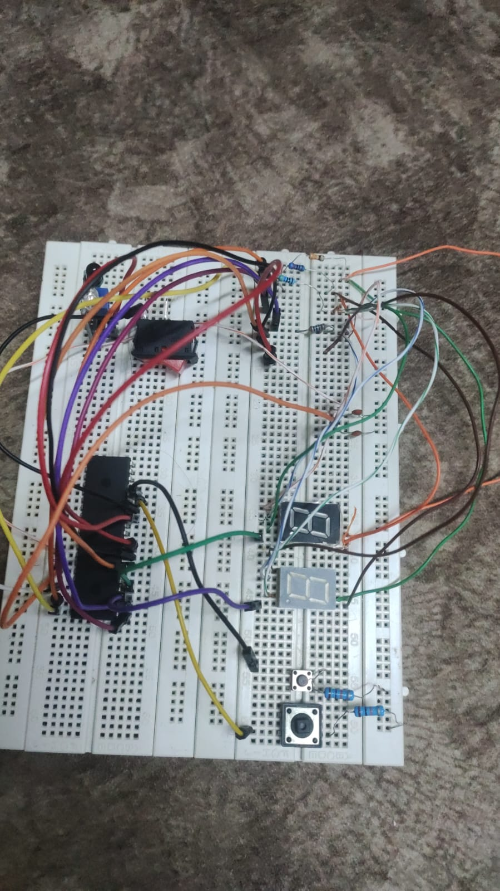

# 🌀 Economical Smart Fan System
> **Embedded Systems Lab — Spring 2024** | University of Jordan, Computer Engineering Department

---

## 📋 Project Overview

An intelligent fan control system built on the **PIC16F877A** microcontroller that automatically adjusts fan speed based on room occupancy. As more people enter a room, the fan speeds up proportionally — saving energy when the room is empty or lightly occupied and running at full speed only when needed.

The system was designed, simulated in **Proteus**, and built as a working **hardware prototype** on a breadboard. All code is written in **PIC Assembly language**.

---

## 🎯 Features

| Feature | Description |
|---|---|
| 🔴 IR Sensor Detection | Detects each person entering the room via interrupt on RB0 |
| ⚙️ PWM Motor Control | Fan speed controlled via Timer2 PWM on CCP1 (RC2) |
| 📟 7-Segment Display | Dual multiplexed displays show either N (count) or N_max |
| 🔘 Toggle Switch | RB1 switches display between current count (N) and max count (N_max) |
| ⬆️⬇️ Push Buttons | RB2/RB3 manually increment or decrement N or N_max |
| ⚡ Interrupt-Driven | IR entry events handled via external interrupt (INTE) |

---

## 🧠 How It Works

```
START
  │
  ▼
Initialize ports, PWM (Timer2), interrupts
  │
  ▼
MAIN LOOP
  ├── UPDATE_DISPLAY
  │     ├── Toggle = 0? → Show N on 7-seg
  │     └── Toggle = 1? → Show N_max on 7-seg
  │
  └── CHECK_BUTTONS
        ├── RB2 pressed + Toggle=0 → Increment N
        ├── RB2 pressed + Toggle=1 → Increment N_max
        ├── RB3 pressed + Toggle=0 → Decrement N
        └── RB3 pressed + Toggle=1 → Decrement N_max

ISR (on RB0 interrupt — IR sensor)
  ├── Clear interrupt flag
  ├── Increment N (cap at N_max)
  └── UPDATE_PWM → Duty Cycle = (N / N_max) × 255
```

---

## 📐 PWM Duty Cycle Formula

Fan speed is controlled by:

```
D = N / N_max        (where N ≤ N_max)
```

The average voltage applied to the DC motor:

```
V_avg = D × Vs
```

**Implementation in assembly:** Since PIC16 has no hardware divide, the algorithm uses repeated subtraction combined with a multiply-by-25 approach to compute `(N × 256) / N_max` as the CCPR1L register value.

**Timer2 configuration:**
```
Time = (PR2 + 1) × 4/Fosc × prescale × postscale
PR2 = 0xFF, Prescaler = 16
```

---

## 🔌 Pin Mapping (PIC16F877A)

| Pin | Direction | Function |
|---|---|---|
| RB0 | Input | IR sensor (external interrupt) |
| RB1 | Input | Toggle switch (display mode) |
| RB2 | Input | Button UP |
| RB3 | Input | Button DOWN |
| RB4–RB7 | Output | (reserved / outputs) |
| RC2/CCP1 | Output | PWM signal to DC motor |
| RC4 | Output | 7-seg driver — tens digit |
| RC5 | Output | 7-seg driver — units digit |
| RD[0–7] | Output | 7-segment display segments |

---

## 🖼️ Hardware Prototype

The system was built and tested on a breadboard with:
- PIC16F877A microcontroller
- IR sensor module at the room entrance
- DC fan motor driven via PWM
- Two 7-segment displays (multiplexed)
- Toggle switch + 2 push buttons
- Crystal oscillator + decoupling capacitors
- 7805 voltage regulator for stable 5V supply



---

## 📁 Repository Structure

```
📦 smart-fan-system/
├── 📄 README.md                     ← You are here
├── 📄 smart_fan.asm                 ← PIC assembly source code
├── 📄 requirements                  ← Original project specifications
├── 📄 group_report.pdf              ← Full project report (hardware, flowchart, testing)
└── 📄 hardware_photo.jpg            ← Breadboard prototype photo
```

---

## 🚀 Running the Simulation

1. Open **MPLAB IDE** and load `Proj.asm`
2. Build → generates a `.hex` file in the project folder
3. Open **Proteus**, wire the circuit per pin mapping above
4. Double-click PIC16F877A → load the `.hex` file
5. Run simulation — toggle the IR sensor input on RB0 to simulate people entering
6. Observe PWM duty cycle change and 7-seg display update

---

## 👥 Team

| Name | Contribution |
|---|---|
| Aya Saadeh | Code, Proteus simulation |
| Rania Maher | Code, Proteus simulation, Report |
| Lojain Osama | Hardware prototype, Report |
| Yaqeen Ahmad | Hardware prototype |

---

## 📖 Course Info

- **University:** University of Jordan
- **Department:** Computer Engineering
- **Course:** Embedded Systems Lab (0907334)
- **Instructor:** Dr. Talal El-Edwan / Eng. Ola Jaloudy
- **Semester:** Spring 2024
